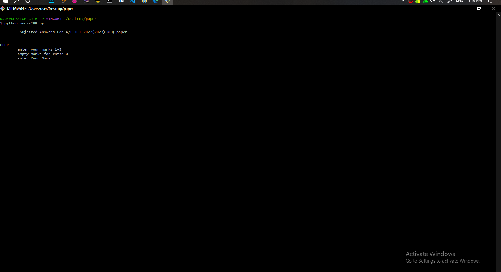
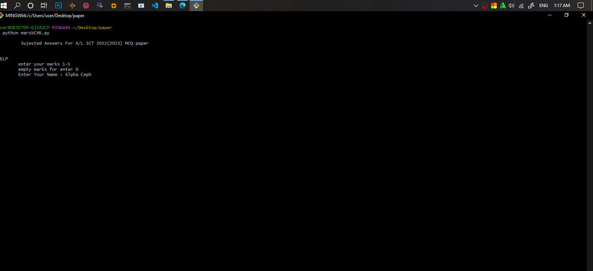
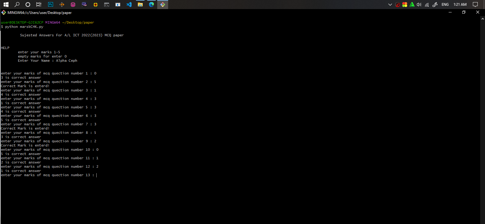
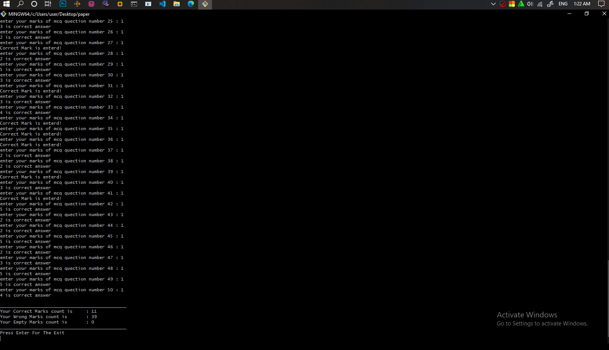
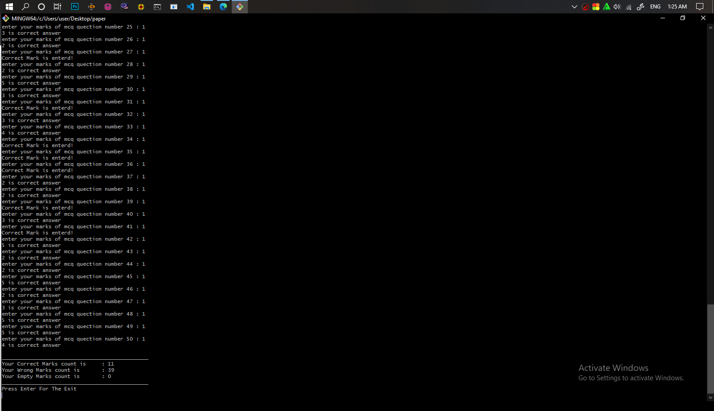
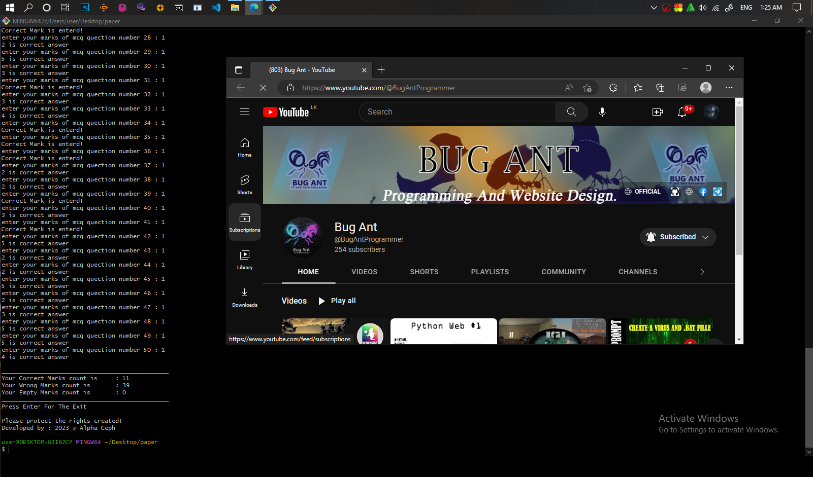

# Sujested-Answers-For-A-L-ICT-2022-2023-MCQ-paper
Check Your Answers now

#not finished! please wait

<h2>This can be used to check the marks of the first part of A Level ICT in the year 2022(2023).</h2>

You can change the answers in the first line of this code and discuss your marks in another paper.

Python is built around the CLI. So it is difficult to change something entered here. Enter the data carefully.

<h2>Instructions for use</h2>

<li>First download and run this code</li>

<li>After that run it</li>

<li>Your name will be asked, enter the name</li>

<li>Next you will be asked the question number, enter the number you applied in MCQ. If no answer is given, enter 0.</li>

<li>After answering all 50 questions, your ICT paper marks will be displayed.</li>

<li>Shows correct marks, incorrect marks and blank marks</li>

<li>Finally it will show relief and press enter button to quit</li>

<li>Your character set will be searched as a .txt file with your name</li>

<li>Please protect the creator's rights. Finally, my YouTube channel opens as a web page</li>

